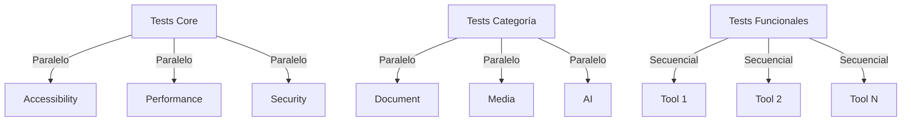
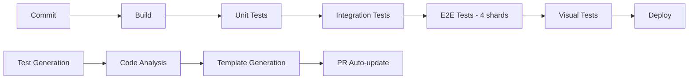

# Sistema de Testing Completo - New Life Solutions

## 📋 Visión General

Sistema de testing modular y escalable para 54+ herramientas con capacidad de crecimiento diario. Arquitectura basada en patrones de diseño que permite generación automática de tests y mantenimiento mínimo.

## 🏗️ Arquitectura Modular

### Estructura de Carpetas
```
tests/
├── architecture/           # Tests de arquitectura y patrones
├── categories/            # Tests por categoría de herramienta
│   ├── document/         # PDF, Word, etc.
│   ├── media/            # Imágenes, video, audio
│   ├── ai/               # Herramientas de IA
│   ├── utility/          # Utilidades generales
│   └── games/            # Juegos
├── components/           # Tests de componentes UI
├── core/                 # Tests fundamentales
│   ├── accessibility/    # WCAG 2.1 AA compliance
│   ├── performance/      # Performance y optimización
│   ├── security/         # Seguridad y validación
│   └── integration/      # Flujos de integración
├── fixtures/             # Archivos de prueba
│   ├── documents/        # PDFs, DOCs, etc.
│   ├── images/           # JPG, PNG, SVG, etc.
│   ├── media/            # MP4, MP3, etc.
│   └── edge-cases/       # Casos límite
├── generators/           # Scripts de generación
├── templates/            # Plantillas de tests
├── utils/                # Utilidades de testing
├── visual/               # Tests de regresión visual
└── e2e/                  # Tests end-to-end completos
```

### Patrones de Diseño

#### 1. Factory Pattern - Generación de Tests
```typescript
// tests/factories/ToolTestFactory.ts
export class ToolTestFactory {
  static createTestSuite(tool: Tool): TestSuite {
    return new TestSuiteBuilder()
      .addCoreTests(tool)
      .addCategoryTests(tool.category)
      .addFunctionalTests(tool)
      .addVisualTests(tool)
      .build();
  }
}
```

#### 2. Strategy Pattern - Ejecución de Tests
```typescript
// tests/strategies/ExecutionStrategy.ts
interface ExecutionStrategy {
  execute(test: Test): Promise<TestResult>;
}

class ParallelStrategy implements ExecutionStrategy {
  async execute(test: Test): Promise<TestResult> {
    // Ejecución en paralelo
  }
}

class ShardingStrategy implements ExecutionStrategy {
  async execute(test: Test): Promise<TestResult> {
    // Ejecución por shards
  }
}
```

#### 3. Observer Pattern - Monitoreo de Tests
```typescript
// tests/observers/TestObserver.ts
interface TestObserver {
  onTestStart(test: Test): void;
  onTestComplete(result: TestResult): void;
  onTestError(error: TestError): void;
}
```

## 🧪 Tipos de Tests

### 1. Tests Core (Obligatorios para todas las herramientas)
- **Accessibility**: WCAG 2.1 AA compliance
- **Performance**: Carga < 3s, TTI < 5s
- **Security**: Validación de archivos, XSS prevention
- **SEO**: Meta tags, schema markup, canonical URLs
- **Mobile**: Responsive design, touch targets
- **Cross-browser**: Chrome, Firefox, Safari, Edge

### 2. Tests por Categoría

#### Document Tools (PDF, Word, etc.)
```typescript
// tests/categories/document/BaseDocumentTest.ts
export abstract class BaseDocumentTest {
  protected abstract getFileExtensions(): string[];
  protected abstract getMaxFileSize(): number;

  async testFileValidation(): Promise<void> {
    // Validar extensiones permitidas
    // Validar tamaño máximo
    // Validar corrupción de archivos
  }

  async testProcessing(): Promise<void> {
    // Procesamiento exitoso
    // Manejo de errores
    // Progreso y cancelación
  }
}
```

#### Media Tools (Imágenes, Video, Audio)
- Validación de formatos y codecs
- Tests de calidad y compresión
- Tests de metadata extraction
- Tests de conversión entre formatos

#### AI Tools
- Tests de precisión y calidad
- Tests de rate limiting
- Tests de manejo de errores de API
- Tests de feedback y mejora

### 3. Tests Funcionales E2E
- Upload de archivos reales
- Procesamiento completo
- Descarga y verificación de resultados
- Flujos de usuario completos

### 4. Tests Visuales
- Regresión visual con Percy
- Capturas multi-dispositivo
- Comparación pixel-perfect
- Detección de cambios no intencionales

## 🚀 Estrategia de Ejecución

### Paralelización por Niveles



### Sharding Inteligente
```typescript
// tests/utils/TestSharding.ts
export class TestSharding {
  static distribute(tests: Test[], shards: number): Test[][] {
    // Algoritmo de distribución por:
    // 1. Duración histórica
    // 2. Complejidad
    // 3. Recursos requeridos

    return balancedDistribution;
  }
}
```

## 🤖 Generación Automática

### 1. Generador de Tests Base
```bash
npm run test:generate --tool=pdf-merge --category=document
```

### 2. Análisis de Código
```typescript
// tests/generators/CodeAnalyzer.ts
export class CodeAnalyzer {
  static analyzeTool(toolPath: string): ToolMetadata {
    // Extraer:
    // - Inputs y outputs
    // - Validaciones
    // - Estados del componente
    // - Event handlers

    return metadata;
  }
}
```

### 3. Plantillas Dinámicas
```typescript
// tests/templates/ToolTestTemplate.ts
export const generateToolTest = (tool: Tool) => `
import { test, expect } from '@playwright/test';
import { waitForReactHydration } from '../utils/hydration';
import { validateFile } from '../utils/file-validation';

test.describe('${tool.name} - Functional Tests', () => {
  test.beforeEach(async ({ page }) => {
    await page.goto('${tool.href}');
    await waitForReactHydration(page);
  });

  test('should process ${tool.category} files correctly', async ({ page }) => {
    // Auto-generated test based on tool metadata
    ${generateTestLogic(tool)}
  });
});
`;
```

## 📊 Métricas y KPIs

### Coverage Targets
- **Line Coverage**: > 90%
- **Branch Coverage**: > 85%
- **Functional Coverage**: 100% de casos críticos
- **Visual Coverage**: 100% de páginas y estados

### Performance Targets
- **Test Execution**: < 10 minutos total
- **Test Individual**: < 30 segundos
- **Setup Time**: < 2 minutos
- **Retry Rate**: < 5%

### Quality Gates
```yaml
# .github/workflows/test-gates.yml
gates:
  accessibility:
    wcag_level: "AA"
    violations: 0

  performance:
    lighthouse_score: 90
    tti: 5000ms

  security:
    vulnerabilities: 0
    audit_score: 95
```

## 🔧 CI/CD Pipeline

### Flujo Optimizado


### Optimizaciones
1. **Caching Multi-nivel**:
   - node_modules
   - Playwright browsers
   - Build artifacts
   - Test results (para flaky tests)

2. **Parallelización Inteligente**:
   - Sharding dinámico
   - Priorización por riesgo
   - Ejecución diferida de tests no críticos

3. **Early Failures**:
   - Tests críticos primero
   - Fail-fast en CI
   - Reporte inmediato

## 📈 Plan de Crecimiento

### Fase 1: Foundation (Semana 1-2)
- Implementar arquitectura base
- Migrar tests existentes
- Setup CI/CD pipeline

### Fase 2: Automation (Semana 3-4)
- Generador de tests automático
- Templates dinámicos
- Auto-update de tests

### Fase 3: Intelligence (Semana 5-6)
- ML para flaky test detection
- Predictive test selection
- Auto-healing tests

### Fase 4: Scale (Semana 7+)
- Distributed testing
- Cloud execution
- Performance optimization

## 🛠️ Herramientas y Stack

### Testing Framework
- **Playwright**: E2E testing
- **Percy**: Visual regression
- **Axe-core**: Accessibility
- **Lighthouse**: Performance

### Development Tools
- **TypeScript**: Type safety
- **ESLint**: Code quality
- **Prettier**: Formatting
- **Husky**: Git hooks

### CI/CD
- **GitHub Actions**: Automation
- **Vercel**: Deployment
- **Codecov**: Coverage
- **Sentry**: Error tracking

## 🔍 Monitoreo y Mantenimiento

### Dashboard de Calidad
```typescript
// tests/dashboard/QualityDashboard.ts
export class QualityDashboard {
  static generateReport(): QualityReport {
    return {
      coverage: this.calculateCoverage(),
      flakyTests: this.identifyFlakyTests(),
      performance: this.analyzePerformance(),
      trends: this.calculateTrends()
    };
  }
}
```

### Alertas Automáticas
- Tests flaky > 3 ejecuciones
- Coverage < 90%
- Performance regression > 20%
- Security vulnerabilities

### Maintenance Schedule
- **Diario**: Revisión de tests fallidos
- **Semanal**: Análisis de flaky tests
- **Mensual**: Actualización de dependencias
- **Trimestral**: Revisión de arquitectura

## 📚 Documentación

### Para Desarrolladores
- Guía de contribución
- Templates de PR
- Debugging guide
- Best practices

### Para QA
- Test case design
- Bug reporting
- Regression guidelines
- Release process

### Para Producto
- Quality metrics
- Risk assessment
- Release readiness
- User impact analysis

## 🎯 Resultados Esperados

### Corto Plazo (1 mes)
- 100% cobertura de tests core
- Reducción 50% en tests flaky
- Tiempo de ejecución < 10 min
- 0 regressions en producción

### Medio Plazo (3 meses)
- 95% cobertura total
- Generación automática 80%
- Auto-healing activo
- Performance predictivo

### Largo Plazo (6+ meses)
- Zero-touch testing
- Self-healing completo
- Predictive quality
- Continuous optimization

---

**Next Steps**: Implementar la arquitectura base y generadores automáticos para escalar a 100+ herramientas con mantenimiento mínimo.